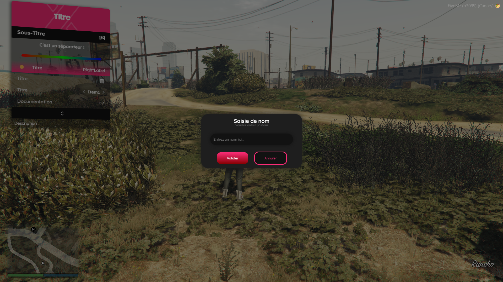

# KeyboardInput

La fonction **KeyboardInput** est utile lorsque vous devez demander une saisie de texte à l'utilisateur via un clavier virtuel.

## Fonction `KeyboardInput`

La syntaxe pour utiliser l'entrée clavier est la suivante :

```lua
zUI.KeyboardInput(Title, Subtitle, PlaceHolder, DefaultValue, MaxStringLength)
```

Cette fonction renvoie une chaîne de caractères (string) contenant la saisie de l'utilisateur ou `nil` si la saisie a été annulée.

### Paramètres

- **Title** _[string]_ : Le titre de l'interface de saisie.
- **Subtitle** _[string]_ : Le sous-titre de l'interface de saisie.
- **PlaceHolder** _[string]_ : Le texte indicatif à afficher dans le champ de saisie.
- **DefaultValue** _[string]_ : La valeur par défaut dans le champ de saisie (facultatif).
- **MaxStringLength** _[number]_ : Le nombre maximum de caractères que l'utilisateur peut saisir.

### Exemple d'utilisation

Voici un exemple d'utilisation de la fonction **KeyboardInput** :

```lua
    Items:AddButton("Titre", "Description", {}, function(onSelected)
        if onSelected then
            local userInput = zUI.KeyboardInput("Saisie de nom", "Veuillez entrer un nom", "Entrez un nom ici...", "", 25)
            if userInput then
                print("Nom saisi par l'utilisateur : " .. userInput)
            else
                print("L'utilisateur a annulé la saisie.")
            end
        end
    end)
```

### Aperçu de l'exemple



### Résumé

Pour utiliser l'interface de saisie clavier dans **zUI** :

1. Appelez la fonction `zUI.KeyboardInput` pour afficher l'interface de saisie.
2. Spécifiez le titre, le sous-titre, le placeholder, la valeur par défaut (optionnelle) et la longueur maximale du texte.
3. La fonction renverra la saisie de l'utilisateur ou `nil` s'il a annulé l'opération.
