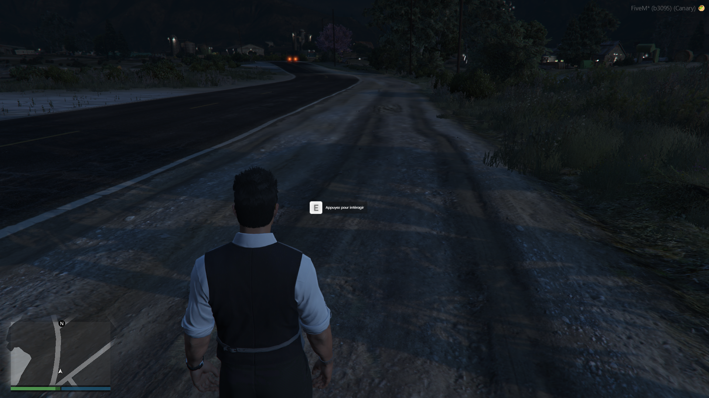
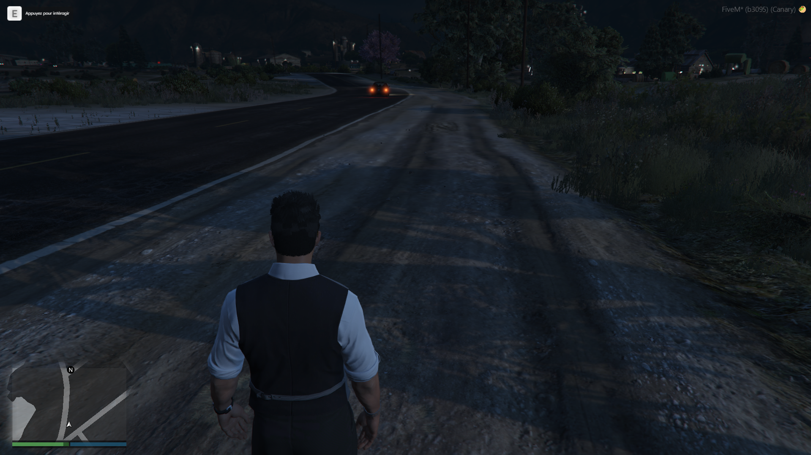

# ShowHelpNotification

La fonction **ShowHelpNotification** est utile dans le cas où vous devriez indiquer au joueur sur quelle touche il devra appuyer pour interagir avec votre script.

## Fonction `ShowHelpNotification`

La syntaxe pour afficher une notification d'aide est la suivante :

```lua
zUI.ShowHelpNotification(Key, Description, Coords)
```

### Paramètres

- **Key** _[string]_ : Lettres à afficher dans le compartiment de la touche.
- **Description** _[string]_ : Description de l'action qui va être effectuée.
- **Coords** _[vector3 | nil]_ : Coordonnées où va être affichée la notification (si vous la voulez en 3D).

### Exemple d'utilisation

Voici un exemple d'utilisation de la **Notification d'aide** en **3D** :

```lua
Citizen.CreateThread(function()
    local Delay = 500
    while true do
        Citizen.Wait(Delay)
        local playerCoords = GetEntityCoords(PlayerPedId())
        local Coords = vector3(0, 0, 0)
        if #(playerCoords - Coords) < 5.0 then
            Delay = 0
            zUI.ShowHelpNotification("E", "Appuyez pour interagir", Coords)
        end
    end
end)
```

Voici un exemple d'utilisation de la **Notification d'aide** en **2D** :

```lua
Citizen.CreateThread(function()
    local Delay = 500
    while true do
        Citizen.Wait(Delay)
        local playerCoords = GetEntityCoords(PlayerPedId())
        local Coords = vector3(0, 0, 0)
        if #(playerCoords - Coords) < 5.0 then
            Delay = 0
            zUI.ShowHelpNotification("E", "Appuyez pour interagir")
        end
    end
end)
```

### Aperçu de l'exemple

**3D**:



**2D**:



## Résumé

Pour afficher une notification d'aide dans **zUI** :

1. Utilisez `zUI.ShowHelpNotification` pour appeler la fonction qui affiche l'interface.
2. Spécifiez la touche et la description.
3. Optionnellement, spécifiez les coordonnées dans le cas où elle doit être en 3D.
