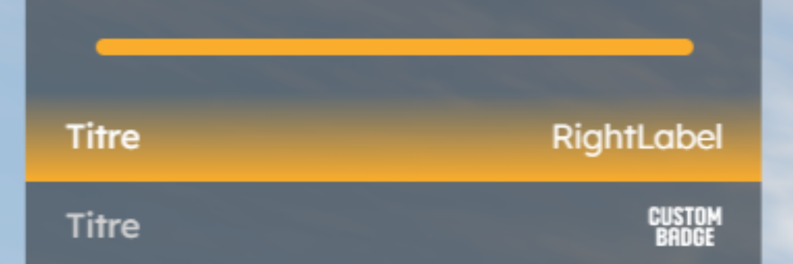

# Bouton

Les boutons dans **zUI** sont des éléments interactifs essentiels qui permettent aux utilisateurs de réaliser des actions lorsqu'ils sont cliqués. Vous pouvez ajouter des boutons à vos menus en utilisant la fonction `Items:AddButton`. Voici comment les créer et les personnaliser.

## Fonction `AddButton`

La syntaxe pour ajouter un bouton est la suivante :

```lua
Items:AddButton(Title, Description, Styles, Action, Submenu)
```

### Paramètres

- **Title** _[string]_ : Le texte qui s'affiche sur le bouton. C'est le titre du bouton.
- **Description** _[string]_ : (Optionnel) Une brève description ou un sous-titre pour le bouton, affiché en dessous du titre.
- **Styles** _[table]_ : Un tableau optionnel pour personnaliser l'apparence du bouton.
- **Action** _[function(onSelected, onHovered)]_ : Action à exécuter lorsque le bouton est actionné.
  Cette fonction prend deux paramètres :
  > - `onSelected` (vrai si le bouton a été sélectionné)
  > - `onHovered` (vrai si le bouton est survolé).
- **Submenu** _[zUI Instance]_ : (Optionnel) Un sous-menu à ouvrir lorsque le bouton est cliqué. Si aucun sous-menu n'est spécifié, le bouton exécute uniquement l'action définie.

### Exemple de Création de Bouton

Voici un exemple illustrant la création d'un bouton avec **zUI** :

```lua
Menu:SetItems(function(Items)
    Items:AddButton(
        "Ouvrir Carte", -- Title
        "Accédez à la carte du jeu", -- Description
        { RightLabel = "→" }, -- Styles
        function(onSelected, onHovered)
            if onSelected then
                -- Code à exécuter lorsque le bouton est sélectionné
                print("Carte ouverte!")
            end
        end,
        nil -- Submenu (aucun sous-menu pour ce bouton)
    )
end)
```

### Explication

1. **Title** : "Ouvrir Carte" est le texte affiché sur le bouton.
2. **Description** : "Accédez à la carte du jeu" fournit une brève description du bouton.
3. **Styles** : Propriétés de style à ajouter au menu.
   > - **IsDisabled** _[boolean]_ : Définir l'êtat du bouton (s'il est désactivé ou pas).
   > - **Color** _[string]_ : Définir la couleur du bouton.
   > - **RightLabel** _[string]_ : Ajouter un texte sur la droite du bouton.
   > - **RightBadge** _[string]_ : Ajouter un badge sur la droite du bouton.
   > - **LeftBadge** _[string]_ : Ajouter un badge sur la gauche du bouton.
4. **Action** : La fonction spécifiée dans `Action` s'exécute lorsque le bouton est sélectionné. Ici, elle affiche "Carte ouverte!" dans la console lorsque le bouton est cliqué.
5. **Submenu** : Comme `Submenu` est défini sur `nil`, le bouton n'ouvre pas de sous-menu mais seulement exécute l'action.

### Exemple Visuel

Voici à quoi peut ressembler un bouton dans l'interface utilisateur de **zUI** :



## Résumé

Pour créer un bouton dans **zUI** :

1. Utilisez `Items:AddButton` pour ajouter le bouton à un menu.
2. Spécifiez le titre, la description, les styles et l'action à exécuter.
3. Optionnellement, associez un sous-menu au bouton pour une navigation plus complexe.

Les boutons sont des éléments puissants qui permettent une interaction fluide et intuitive avec vos menus NUI. Utilisez-les pour offrir une expérience utilisateur riche et engageante.
