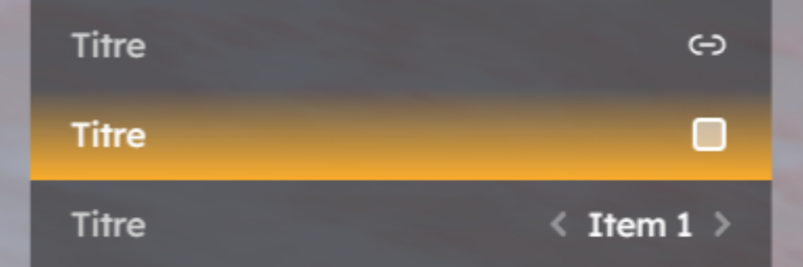

# Checkbox

Les checkboxes dans **zUI** permettent aux utilisateurs de sélectionner ou désélectionner des options, offrant ainsi un moyen interactif pour gérer les états binaires dans vos menus. Vous pouvez ajouter des checkboxes à vos menus en utilisant la fonction `zUI:AddCheckbox`. Voici comment les créer et les personnaliser.

## Fonction `AddCheckbox`

La syntaxe pour ajouter une checkbox est la suivante :

```lua
zUI:AddCheckbox(Title, Description, State, Styles, Action)
```

### Paramètres

- **Title** _[string]_ : Le texte qui s'affiche à côté de la checkbox. C'est le titre de la checkbox.
- **Description** _[string | nil]_ : (Optionnel) Une brève description ou un sous-titre pour la checkbox, affiché en dessous du titre.
- **State** _[boolean]_ : L'état initial de la checkbox (cochée ou décochée).
- **Styles** _[table]_ : Un tableau optionnel pour personnaliser l'apparence de la checkbox.
- **Action** _[function(onSelected, onHovered)]_ : Action à exécuter lorsque la checkbox est sélectionnée ou survolée. Cette fonction prend deux paramètres :
  > - `onSelected` (vrai si la checkbox a été sélectionnée)
  > - `onHovered` (vrai si la checkbox est survolée).

### Exemple de Création de Checkbox

Voici un exemple illustrant la création d'une checkbox avec **zUI** :

```lua
local CheckboxState = false

Menu:SetItems(function(Items)
    Items:AddCheckbox(
        "Titre", -- Title
        "Description", -- Description
        CheckboxState, -- État initial
        {}, -- Styles (aucun style spécifique pour cet exemple)
        function(onSelected, onHovered)
            if onSelected then
                -- Inverse l'état de la checkbox lorsqu'elle est sélectionnée
                CheckboxState = not CheckboxState
                print("Checkbox état : " .. tostring(CheckboxState))
            end
        end
    )
end)
```

### Explication

1. **Title** : "Titre" est le texte affiché à côté de la checkbox.
2. **Description** : "Description" fournit une brève explication ou un sous-titre pour la checkbox.
3. **State** : `CheckboxState` détermine si la checkbox est initialement cochée ou non.
4. **Styles** : Vous pouvez personnaliser l'apparence de la checkbox en ajoutant des éléments dans le tableau `Styles`. Pour cet exemple, aucun style spécifique n'est utilisé.
5. **Action** : La fonction spécifiée dans `Action` s'exécute lorsque la checkbox est sélectionnée. Ici, elle inverse l'état de la checkbox et affiche l'état actuel dans la console.

### Exemple Visuel

Voici à quoi peut ressembler une checkbox dans l'interface utilisateur de **zUI** :



## Résumé

Pour créer une checkbox dans **zUI** :

1. Utilisez `zUI:AddCheckbox` pour ajouter la checkbox à un menu.
2. Spécifiez le titre, la description, l'état initial, les styles et l'action à exécuter.

Les checkboxes sont des éléments interactifs utiles pour gérer des choix binaires dans vos menus, offrant une expérience utilisateur fluide et intuitive.
