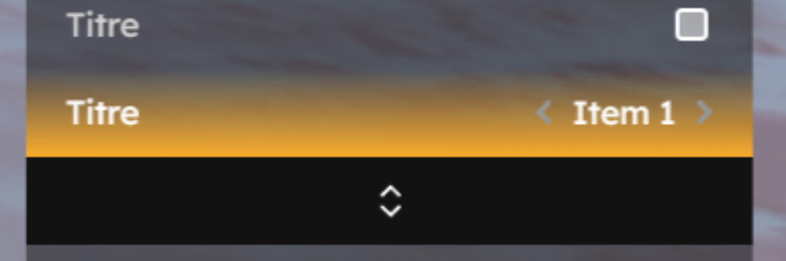

# Liste

Les listes dans **zUI** permettent aux utilisateurs de sélectionner parmi plusieurs options. Elles sont idéales pour offrir des choix dynamiques ou pour afficher des éléments dans vos menus. Vous pouvez ajouter des listes à vos menus en utilisant la fonction `zUI:AddList`. Voici comment les créer et les personnaliser.

## Fonction `AddList`

La syntaxe pour ajouter une liste est la suivante :

```lua
zUI:AddList(Title, Description, Items, Styles, Action)
```

### Paramètres

- **Title** _[string]_ : Le texte qui s'affiche en haut de la liste. C'est le titre de la liste.
- **Description** _[string]_ : (Optionnel) Une brève description ou un sous-titre pour la liste, affiché en dessous du titre.
- **Items** _[table]_ : Un tableau des éléments disponibles dans la liste. Chaque élément est une option que l'utilisateur peut sélectionner.
- **Styles** _[table]_ : Un tableau pour personnaliser l'apparence de la liste.
- **Action** _[function(onSelected, onHovered, onListChange, index)]_ : Action à exécuter lorsque l'utilisateur interagit avec la liste. Cette fonction prend quatre paramètres :
  > - `onSelected` (vrai si un élément de la liste est sélectionné)
  > - `onHovered` (vrai si un élément de la liste est survolé)
  > - `onListChange` (vrai si la liste a été modifiée)
  > - `index` (index de l'élément sélectionné dans la liste)

### Exemple de Création de Liste

Voici un exemple illustrant la création d'une liste avec **zUI** :

```lua
Menu:SetItems(function(Items)
    Items:AddList(
        "Choisissez une couleur", -- Title
        "Sélectionnez votre couleur préférée", -- Description
        { "Rouge", "Vert", "Bleu" }, -- Items
        { RightLabel = "→", Color = "#ffffff" }, -- Styles
        function(onSelected, onHovered, onListChange, index)
            if onSelected then
                print("Couleur sélectionnée : " .. Items[index])
            end
        end -- Action
    )
end)
```

### Explication

1. **Title** : "Choisissez une couleur" est le texte affiché en haut de la liste.
2. **Description** : "Sélectionnez votre couleur préférée" fournit une brève description de la liste.
3. **Items** : `{ "Rouge", "Vert", "Bleu" }` est un tableau des options disponibles dans la liste.
4. **Styles** : Propriétés de style à ajouter à la liste.
   > - **IsDisabled** _[boolean]_ : Détermine si la liste est désactivée.
   > - **Color** _[string]_ : Définit la couleur de la liste.
   > - **RightLabel** _[string]_ : Ajoute un texte à droite de la liste.
   > - **RightBadge** _[string]_ : Ajoute un badge à droite de la liste.
   > - **LeftBadge** _[string]_ : Ajoute un badge à gauche de la liste.
5. **Action** : La fonction spécifiée dans `Action` s'exécute lorsque l'utilisateur interagit avec la liste. Ici, elle affiche la couleur sélectionnée dans la console.

### Exemple Visuel

Voici à quoi peut ressembler une liste dans l'interface utilisateur de **zUI** :



## Résumé

Pour créer une liste dans **zUI** :

1. Utilisez `zUI:AddList` pour ajouter la liste à un menu.
2. Spécifiez le titre, la description, les éléments de la liste et les styles.
3. Définissez l'action à exécuter lorsqu'un utilisateur interagit avec la liste.

Les listes offrent une manière efficace et élégante de présenter des options multiples à vos utilisateurs. Utilisez-les pour améliorer l'interaction et la fonctionnalité de vos menus NUI.
